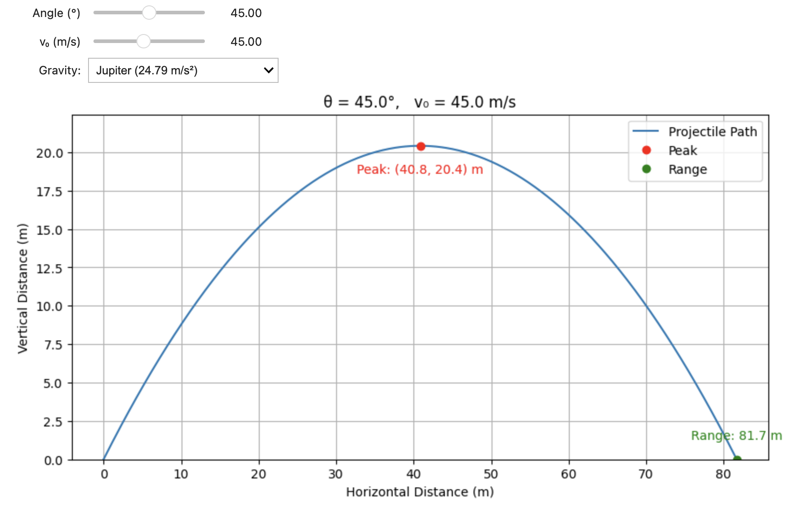

# Week 1: Projectile Motion Simulation (No Drag)

This project contains a Python simulation of projectile motion without air resistance, built using **Matplotlib** and **ipywidgets** for interactive visualization.

Users can adjust the following parameters:

- **Angle of projection** (`θ`)
- **Initial velocity** (`v₀`)
- **Gravitational acceleration** (`g`) corresponding to different celestial bodies

## 🌟 Features

- Interactive **sliders** to adjust the angle and velocity
- **Dropdown menu** to select gravity: Earth, Moon, Mars, or Jupiter
- Visual indicators for:
  - **Peak point** of the trajectory
  - **Total horizontal range**
- Smart placement of annotations to avoid overlap with title or plot borders

## 📽️ Output

The plot shows the path of the projectile and updates dynamically as inputs change. It includes:

- Projectile path curve
- Peak of the motion (marked in red)
- Horizontal range point (marked in green)



## 🚀 Getting Started

### Prerequisites

- Python 3.x
- Jupyter Notebook or JupyterLab
- Required libraries:
  ```bash
  pip install matplotlib ipywidgets
  ```

### Running the Simulation

Run the Jupyter Notebook file:

```bash
jupyter notebook Week1_ProjectileMotion_NoDrag.ipynb
```

## 📁 File Structure

```
Week1_ProjectileMotion_NoDrag/
├── Week1_ProjectileMotion_NoDrag.ipynb  # Main simulation notebook
├── README.md                            # Project documentation
```

## 🏷️ Release Notes

### v1.0 (Pre-release)

- Initial implementation of the simulation with interactive sliders
- Added support for gravity selection via dropdown
- Tagged as pre-release pending cleanup and animation integration

## 📜 License

This project is licensed under the MIT License.

## 👨‍💻 Author

Parthasarathy R.

Feel free to contribute or fork the repo at: [github.com/dr-parthasarathy-r](https://github.com/dr-parthasarathy-r)

